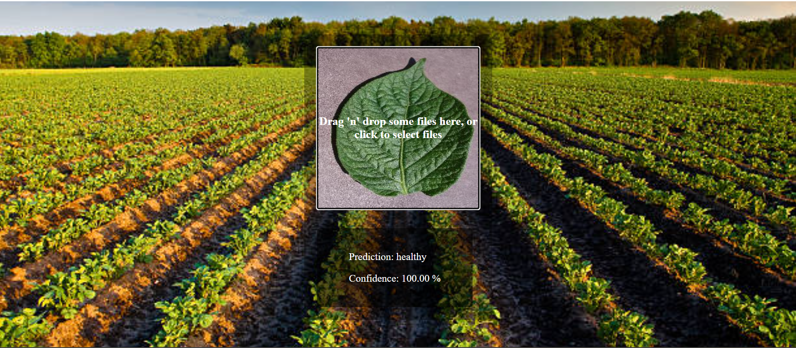

# CNN Image Classification Web Application

This project is a web application that classifies potato leaf health based on uploaded images. It can detect *Potato Early Blight*, *Potato Late Blight*, and *Healthy Potato Leaves*, providing a confidence score for each prediction.

## Project Overview

- **Frontend**: Built with React, featuring a user-friendly interface for image upload via drag-and-drop or file selection.
- **Backend**: FastAPI serves as the API layer, facilitating communication with the TensorFlow Serving model for real-time predictions.
- **Model Deployment**: A pre-trained CNN model, hosted on TensorFlow Serving, processes input images and returns classification results.

<p align="center">
    
</p>

## Dataset

The model is trained on the [PlantVillage Dataset](https://www.kaggle.com/datasets/abdallahalidev/plantvillage-dataset), which includes labeled images of potato leaves with various conditions, helping to differentiate diseased and healthy samples.
p.s you can also find the Dataset here as a ZIP file: C:\<your directory>\potato_classifier\training\PlantVillage.zip

## Application Workflow

1. **Model Training**: The CNN model was trained using the PlantVillage dataset and saved for deployment.
2. **Model Deployment**: The trained model is deployed on TensorFlow Serving, accessed through FastAPI to serve predictions to the frontend.
3. **Web Interface**: Users upload an image of a potato leaf, and the app displays the classification and confidence score.

## Getting Started

To get a local copy of the project running, follow these steps:

### Prerequisites

1. **Clone the Repository**:
    ```bash
    git clone https://github.com/BEKtesfish/CNN-Image-Classification-Web-Application.git
    CNN-Image-Classification-Web-Application
    ```

2. **Create and Activate a Virtual Environment**:
    ```bash
    python -m venv venv
    source venv/bin/activate  # On Windows use `venv\Scripts\activate`
    ```

3. **Install Backend Dependencies**:
    ```bash
    pip install -r requirements.txt
    ```

### Running the Application

1. **Setup TensorFlow Serving**:
   To serve the model with TensorFlow Serving, use Docker:
   ```bash
    docker run -t --rm -p 8501:8501 -v C:<your repository>\potato_classifier\models:/models tensorflow/serving --rest_api_port=8501 --model_config_file=/potato_classifier/models.config
    ```
    For more details, see the [TensorFlow Serving Documentation](https://www.tensorflow.org/tfx/serving/docker).

2. **Run the FastAPI Backend**:
    Inside the api directory, start the backend server:
    ```bash
    cd api
    python main-tf-serving.py
    ```

3. **Run the Frontend**:
    Navigate to the frontend directory, install dependencies, and start the React app:
    ```bash
    cd ../front
    npm install
    npm start
    ```

4. **Access the Application**: Open your browser and go to http://localhost:3000. 
    Here, you’ll find a drag-and-drop section where you can upload an image of a 
    potato leaf to receive predictions and a confidence score

### Additional Resources
Model Training Notebook: In the training folder,contains the Jupyter notebook used for training the CNN model. and
the 1st version of the trained model can be found in the models folder 